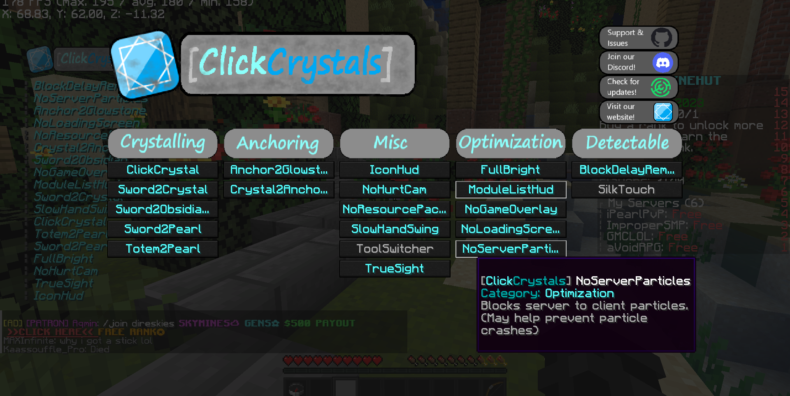

#  ClickCrystals [1.19.4]
Because who needs a clean mod anyways?

---------------------------------------------------------------

## Newest Changes
```yml
Minecraft: 1.19.4
Mod: 1.19.4
Updated to: 1.19.4

- Added Cheats so you can troll
```


## How Do I Use ClickCrystalsPlus?
```yml
KeyBindings:
   APOSTROPHE: Open module settings menu. (Settings are now saved!)
```
```yml
Commands:
   /cctoggle: <module> [on|off|help]
   /optout: [on|off]
   /setautototemdelay: [int shortDelay] [int longDelay]
   /setpmcommand: <command>
   /debugmode: [on|off]
   
```
|  Module (! Means Blatant)  | Description |
| ------------- |:-------------:|
|Anchor2Glowstone|Whenever you place an anchor, switch to glowstone then back after it has been charged.|
|AntiWeakness|Hit Crystals with your sword|
|!AutoCharge|Makes your anchors apear pre-charged when you place them|
|!AutoCope|Copes for you when you die|
|!AutoDTap|Punch the ground with your sword to place an obsidian and crystal|
|!AutoEZ|Taunts players in chat whenever they pop or die|
|!AutoPM|Taunts players in DMs whenever they pop or die|
|AutoTotem|Swaps a new totem from your hotbar into your offhand|
|ClickCrystal|Binds Crystal Placing to left click|
|Crystal2Anchor|Punch the ground with a crystal to switch to anchor|
|CWCrystal|Hold down right click to automaticaly place and break crystals|
|!ForceSword|A more detectable form of anti-weakness, lets you place crystals with your sword. Sounds cool when being used.|
|!InstaAnchor|Places explosions instead of anchors|
|PopCounter|Will count how many times your opponent pops thier totem|
|!TPBlade|Use your sword as an EnderPearl|
|IconHud|Renders the ClickCrystals logo on the screen.|
|NoHurtCam|Removes the annoying screen shake.|
|NoResourcePack| Prevents servers from forcing you to dowload their resource pack.|
|SlowHandSwing| Makes your hand swing like mining fatigue.|
|ToolSwitcher| Switches to the right tool for the job.|
|TrueSight| Renders entities as if you were in spectator mode.|
|FullBright| Increases your gamma so you can actually see.|
|ModuleListHud| Shows your active modules on screen.|
|NoGameOverlay| Stops annoying overlays from rendering.|
|NoLoadingScreen| Prevents most loading screens from rendering.|
|NoServerParticles| Prevents servers from sending you particle packets, stopping all particle crashes.|
|!BlockDelayRemover| Removes the delay between breaking a block and starting to break the next block.|
|!Silk Touch| Gives any tool you hold silk touch (Real)|


## But isn't this cheating?
Yes it is a cheat. It automates a lot of tasks, although for every action the mod preforms, you do still have to click.
- This mod has been tested on:
  - `L1festee1`.minehut.gg
  - `OgreDupe`.minehut.gg

## For this Mod You Will Need
```yml
Minecraft Java Edition: 1.19.4
Fabric Loader: 0.14.14 or higher
Fabric API: 1.19.4
To stop: Complaining that it is a cheat. We know it is.
```

## Have A Good One!
- Thanks for downloading ClickCrystalsPlus!
- Make sure to give the OG mod a star on my [Github](https://github.com/itzispyder/clickcrystals)
- Follow the OG project on [Modrinth](https://modrinth.com/mod/clickcrystals)

## SPECIAL THANKS AND SHOUTOUT TO
```yml
ImproperIssues: Helping me learn java
```
